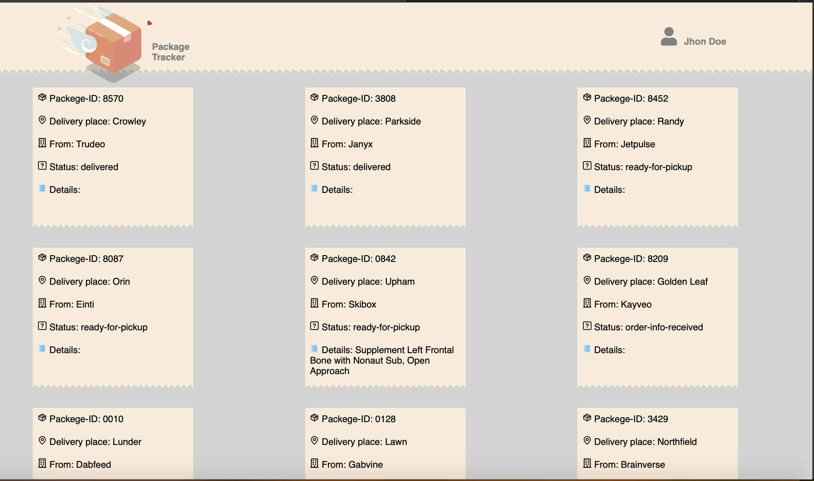

# Project Name & Pitch

# Package Tracker App.

An application used to let our customer tracking their orders, built with:

- React
- JavaScript
- CSS
- Webpak
- Node

# Project Screen Shot(s)

 

# Installation and Setup Instructions

Clone down this repository. You will need node and npm installed globally on your machine.

Installation:

`npm install`

To Run Test Suite:

`npm test`

To Start Server:

`npm start`

To Visit App: 

localhost:3000

`npm run build`

Builds the app for production to the build folder.
It correctly bundles React in production mode and optimizes the build for the best performance.
The build is minified and the filenames include the hashes.
Your app is ready to be deployed!

# Reflection

Originally I wanted to build an application that allowed users tracking the order and show the details of each order Ex. Parcel-ID, status, place to deliver and more. I started this process by using the create-react-app boilerplate, then fitching the API and display them on the browser.

# dependencies

- react: ^17.0.1,
- react-dom: ^17.0.1
- react-icons: ^3.11.0
- react-scripts: 4.0.0
- web-vitals: ^0.2.4
